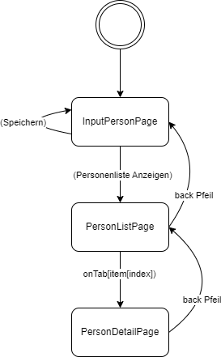

# 1. Aufgabenstellung: Entwicklung einer Budget- und Ausgabenverwaltungs-App mit Flutter

Diese Aufgabe befasst sich mit der Entwicklung einer App zur Verwaltung von Budget und Ausgaben. Ziel ist es, eine Anwendung zu erstellen, die es den Nutzern ermöglicht, ihre finanziellen Aktivitäten effektiv zu verwalten. Die App-Funktionen werden in zwei Kategorien unterteilt: "Must-Have" und "Nice-to-Have". Die "Must-Have" Features sind essenzielle Funktionen, die für die grundlegende Funktionalität der App benötigt werden, während "Nice-to-Have" Features zusätzliche, erweiterte Funktionen darstellen, die den Benutzerkomfort erhöhen.

## 1.1. Welche Daten werden sollen gespeichert werden

Für eine Budget- und Ausgabenverwaltungs-App sollten mindestens folgende Daten gespeichert werden, um eine effektive Verwaltung und Übersicht der finanziellen Aktivitäten zu ermöglichen:

1. **Ausgabegrund**: Eine kurze Beschreibung des Zwecks der Ausgabe. Dies könnte beispielsweise "Lebensmittel", "Bücher", "Transport" oder "Freizeit" sein.

2. **Datum der Ausgabe**: Das genaue Datum, an dem die Ausgabe getätigt wurde. Dies hilft bei der zeitlichen Einordnung und Analyse der Ausgaben.

3. **Betrag der Ausgabe**: Der Geldbetrag, der für den jeweiligen Posten ausgegeben wurde. Dieser sollte als Zahl gespeichert werden, um Berechnungen zu ermöglichen.

4. **Kategorie der Ausgabe**: Eine Klassifizierung der Ausgabe, z.B. "Essen und Trinken", "Bildung", "Transport", "Unterhaltung". Kategorien helfen dabei, Ausgaben zu gruppieren und Muster im Ausgabeverhalten zu erkennen. (*:bulb: Definition als Enum wäre sinnvoll in Kombination mit einem Drop-Downfeld*)

5. **Zahlungsmethode**: Informationen darüber, wie die Ausgabe bezahlt wurde, z.B. Bargeld, Kreditkarte, Debitkarte, Online-Zahlungsdienste. (:bulb: Definition als `Enum` wäre hier sinnvoll, in Verbindung mit einem Drop-Down Auswahlfeld)

Optional, aber nützlich könnten auch sein:

6. **Häufigkeit der Ausgabe**: Informationen darüber, ob es sich um eine einmalige oder wiederkehrende Ausgabe handelt.

7. **Notizen oder Belege**: Ein Feld für zusätzliche Notizen oder die Möglichkeit, Belege als Bild oder Datei anzuhängen.

Diese Datenpunkte ermöglichen eine detaillierte Nachverfolgung und Analyse der finanziellen Gewohnheiten und unterstützen die Nutzer dabei, ein besseres Verständnis für ihre Ausgaben zu entwickeln.

## 1.2. Features bzw. Anforderungen

1. **Must-Have Features**:
   - **Daten-Eingabe mit Validierung**: Eingabefelder für finanzielle Daten mit Basisvalidierungen.
   - **Speicherung in globaler Liste**: Nutzung einer Datenstruktur zur Speicherung der Benutzereingaben.
   - **Anzeige in Listview**: Übersichtliche Darstellung der finanziellen Daten in einer Listenansicht.
   - **Detailansicht der Daten**: Möglichkeit zur Anzeige detaillierter Informationen zu einzelnen Finanzdaten.
   - **Summierte Ausgaben**: Anzeige der Gesamtausgaben und monatlichen Ausgaben.
   - **Speichern der globalen Liste in einer Textdatei (CSV-Format)**: Exportieren der gesamten Daten in einer CSV-Datei.
   - **Laden der Dateiinhalte in die globale Liste beim Start der App**: Importieren der gespeicherten Daten beim Öffnen der App.

2. **Nice-to-Have Features**:
   - **Datenaktualisierung**: Möglichkeit zur Bearbeitung und Aktualisierung vorhandener Datensätze.
   - **Speicherung in SQLite-Datenbank**: Dauerhafte Speicherung der Daten in einer SQLite-Datenbank.
   - **Export als JSON**: Option zum Speichern der Daten im JSON-Format.
   - **Versand per E-Mail im CSV-Format**: Möglichkeit, Daten im CSV-Format zu exportieren und zu versenden.

## 1.3. Umsetzung

### 1.3.1. Umsetzungschritte

1. Erstellen sie ein **Flußdiagramm** für die **App-Navigation** um sich ein Überblick über Navigation und der benötigten Seiten zu schaffen (*siehe Beispiel*)

2. Erstellen sie in einem eigenen Dokument den **Prompt** mit einem entsprechenden einleitenden Text (vgl. vorheriges Beispiel), mit allen oben geforderten Funktionalitäten und zusätzlichen Informationen wie:
   -  Welche Daten soll gespeichert werden, und wie sollen sie gespeichert werden
   -  Welche Art von Eingafelder (Datepicker, Drop-Down, udgl.)
   -  Details zu Validierung (Pflichtfelder, Wertebereiche, usw.)
   -  Layout (Aussehen, welche Widgets verwendet werden sollen)
   -  Verwendete Button -> Navigation auf welche Seite
3. Analysieren Sie gemeinsam mit ihrem Gruppenpartner, den erstellten Pompt auf Vollständigkeit im Bezug auf die beschriebenen Funktionalitäten dahingehend, ob sie mit Hilfe der Beschreibung alle Informationen hätten, um diese Funktionalität zu implementieren (:bulb: ***Mein Rat:** nehmen sie sich für die Erstellung und Analyses des Prompts ausreichend Zeit, da Ändernungen/Ergänzungen im Nachzumeist wesentlich länger dauern*) ;)
4. Versuchen Sie mit Hilfe von ChatGPT, Schritt für Schritt die Implementierung der App
   1. Gehen Sie Schritt für Schritt vor und testen sie wenn möglich und sinnvoll nach jedem Schritt ihre Implementierung
   2. Kommt es zu Fehlern können Sie ChatGPT darauf hinweisen - geben Sie dabei die Fehlermeldung an, bzw. beschreiben sie den Fehler klar und verständlich

### 1.3.2. Allgemeine Angaben zur Umsetzung

- **Mit Hilfe von ChatGPT**:
  - Verwendung von ChatGPT für Programmierhilfe, Problemlösungen und Code-Optimierungen.
  - Unterstützung bei der Klärung von Flutter- und Dart-Konzepten.

- **Pair-Programming**:
  - Durchführung der Aufgabe im Pair-Programming-Stil, wobei Rollen regelmäßig getauscht werden.

- **Kommentare im Code**:
  - Ausführliche Kommentierung des Codes zur Sicherstellung der Klarheit und Wartbarkeit.

- **Abgabe des Links zum Chatverlauf mit ChatGPT**:
  - Einreichung des Links zum Chatverlauf mit ChatGPT als Teil der Projektdokumentation.

### 1.3.3. Fazit

Diese Aufgabe ermöglicht es euch, praktische Erfahrungen in der Entwicklung mobiler Anwendungen zu sammeln und dabei wichtige Kompetenzen in Teamarbeit und Problemlösung mit Unterstützung von KI zu entwickeln. 

Viel Erfolg bei diesem Projekt!

